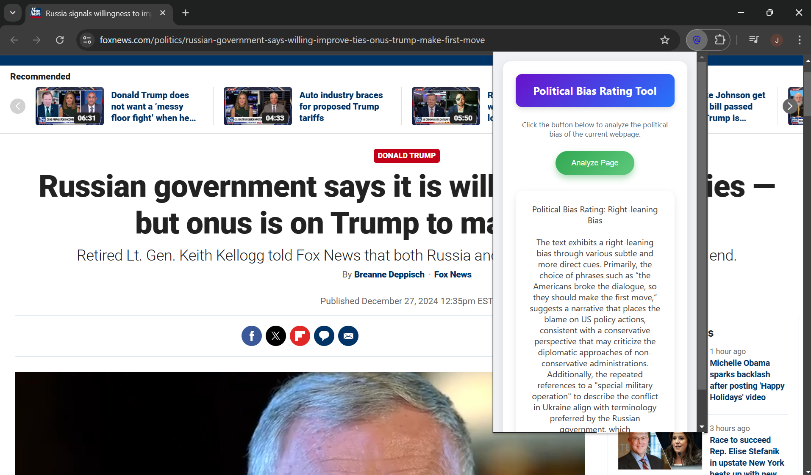

This Chrome extension allows users to instantly analyze the political bias of web content such as news articles or opinion pieces. It extracts the visible text from the current page and sends it to an AI model, which returns a concise bias rating (e.g., "Left-leaning", "Neutral", "Right-leaning") along with a short explanation.

**Features:**
- One-click analysis: Instantly evaluate the political leaning of any article or webpage.
- AI-powered insights: Focuses on subtle language cues, tone, and framing rather than just the topic.
- User-friendly UI: Clean, intuitive popup interface with simple interactions.

**Use Case:** Ideal for readers, researchers, or anyone interested in exploring how content may be framed politically — helping promote critical thinking in media consumption.

**See it in action:**

<video src="../src/bias_extension_videop.mp4" width=100% controls></video>

**Want to try it?**

The chrome extension is not currently live, but you can find it on GitHub through the link below. Please note that you will need your own OpenAI API key in order to use it (further instructions can be found in the GitHub repo)

**Disclaimers**:
- These ratings are generated by an AI model from page text and may be inaccurate or reflect biases. They are provided for informational purposes only and are not advice. No guarantees are made, and I accept no responsibility or liability for how the results are used.
- This extension reads visible text from the current page when you open the popup to enable analysis. No data leaves your device until you press **Analyze**, at which point the selected text is sent to your local server and then to OpenAI for processing. Do not use this extension on pages containing sensitive, confidential, or regulated information (e.g., banking, email, health records, private dashboards). Use at your own risk.